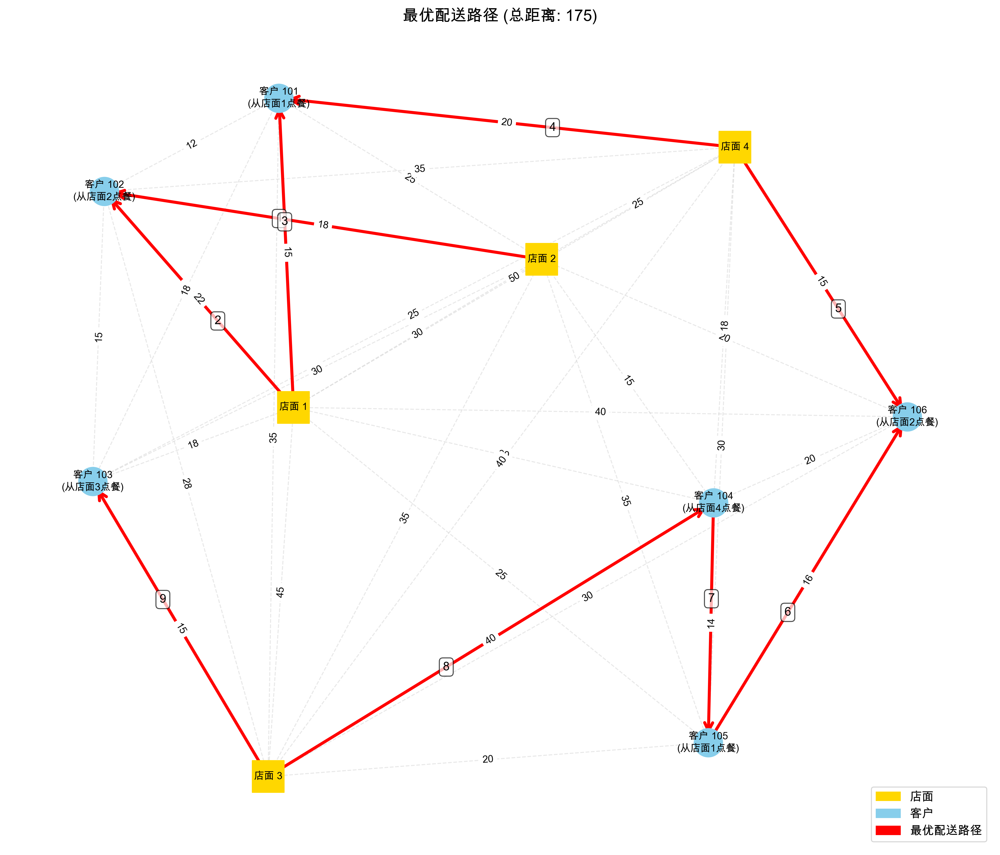
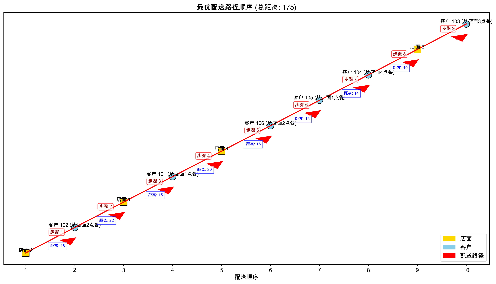

# 外卖配送时间优化系统设计报告

## 一、设计目的

本项目旨在利用数据结构组织配送网络信息，设计高效算法优化外卖配送路径，解决外卖配送过程中面临的路径规划问题。该系统通过合理规划骑手的取餐和送餐顺序，减少配送总距离和时间，提高配送效率，满足实际应用需求。在当前外卖行业高速发展的背景下，配送效率直接影响用户体验和平台运营成本，因此开发一套高效的配送路径优化系统具有重要的实用价值。

## 二、设计任务

本项目选择难度系数0.9的"外卖送餐最短路径设计"任务，具体要求如下：

- 外卖员取餐后可能会针对某一区域附近的客户同时取餐，再分别送餐，最后回到出发点
- 需要设计算法安排外卖员的送餐路线，使总行程最短
- 采用带权图来进行设计，权重表示路径长度

在此基础上，我们对任务进行了扩展，使系统具有更强的实用性：

1. 支持用户设置骑手一次最多取1-5个餐
2. 自动计算最优起始店面
3. 规划完整的配送路径，包括取餐和送餐的顺序
4. 可视化配送路径，直观展示配送过程

## 三、设计要求

### 1. 数据结构类型设计

#### 1.1 逻辑结构设计

通过分析外卖配送网络的实际情况，我们将系统的逻辑结构设计为图结构，具体包括：

1. **图结构**：用于表示配送网络，包含店面节点和客户节点，边表示两点间的距离

   - 节点类型：店面节点(1-10)和客户节点(101及以上)
   - 边权重：表示两节点之间的距离
2. **订单结构**：记录客户订单信息

   - 客户订单与店面的对应关系
   - 待配送订单列表
3. **配送状态结构**：记录当前配送状态

   - 已取未送的订单列表
   - 节点访问状态
   - 配送路径记录
4. **最优路径结构**：保存计算得到的最优配送路径

#### 1.2 物理结构设计

考虑到系统需要频繁进行路径查询和距离计算，我们选择了以下物理结构来实现：

1. **邻接矩阵**：存储配送网络中各节点之间的距离

   - 实现：二维数组 `graph[MAX_NODES][MAX_NODES]`
   - 理由：邻接矩阵适合稠密图，且可以快速查询任意两点间距离
2. **数组**：存储客户订单、配送状态等信息

   - 客户订单对应店面：数组 `customer_store[MAX_NODES]`
   - 节点访问状态：数组 `visited[MAX_NODES]`
   - 最优路径：数组 `optimal_path[MAX_NODES * 2]`
   - 当前取餐状态：数组 `curr_orders[MAX_PICKUPS]`
   - 待配送订单：数组 `pending_orders[MAX_CUSTOMERS]`

### 2. 数据元素和数据项设计

根据系统需求，我们设计了以下数据元素和数据项：

#### 2.1 数据元素

1. **店面节点**：表示餐厅

   - 数据项：店面ID（1-10整数）
2. **客户节点**：表示下单客户

   - 数据项：客户ID（101及以上整数）
3. **路径**：表示两个节点之间的连接

   - 数据项：起点ID、终点ID、距离
4. **订单**：表示客户的订餐信息

   - 数据项：客户ID、店面ID

#### 2.2 数据项

1. **配送网络图**：存储所有节点间的距离关系

   - 数据元素：店面节点、客户节点、路径
2. **订单信息**：存储所有客户的订单

   - 数据元素：订单
3. **配送状态**：记录当前配送过程中的状态

   - 数据元素：已取订单、已访问节点
4. **配送路径**：记录完整的配送路径

   - 数据元素：路径节点序列

### 3. 输入文件分析

系统使用两个输入文件来构建配送网络和订单信息，下面对这两个文件进行详细分析：

#### 3.1 配送网络数据文件（delivery_data.txt）

该文件存储了配送网络中各节点之间的距离信息，包括店面之间、店面到客户之间以及客户之间的距离。

**文件格式**：

```
[店面/客户ID] [店面/客户ID] [距离]
```

**数据组织特点**：

- 店面ID从1开始编号
- 客户ID从101开始编号
- 文件使用注释行（以#开头）组织不同类型的距离数据
- 距离数据表示为无向图，即A到B的距离与B到A的距离相同

**数据内容分析**：

1. **店面之间的距离**：

   ```
   1 2 30    # 店面1到店面2距离为30
   1 3 45    # 店面1到店面3距离为45
   1 4 50    # 店面1到店面4距离为50
   2 3 35    # 店面2到店面3距离为35
   2 4 25    # 店面2到店面4距离为25
   3 4 40    # 店面3到店面4距离为40
   ```

   共有4个店面，形成一个完全图，每两个店面之间都有直接连接。
2. **店面到客户的距离**：

   ```
   # 店面1到客户的距离
   1 101 15  # 店面1到客户101距离为15
   1 102 22  # 店面1到客户102距离为22
   ...
   # 店面2到客户的距离
   2 101 25  # 店面2到客户101距离为25
   ...
   ```

   每个店面到每个客户都有直接连接，表示骑手可以从任意店面直接前往任意客户位置。
3. **客户之间的距离**：

   ```
   # 客户之间的距离（区域1: 101-103）
   101 102 12  # 客户101到客户102距离为12
   101 103 18  # 客户101到客户103距离为18
   102 103 15  # 客户102到客户103距离为15

   # 客户之间的距离（区域2: 104-106）
   104 105 14  # 客户104到客户105距离为14
   104 106 20  # 客户104到客户106距离为20
   105 106 16  # 客户105到客户106距离为16
   ```

   客户被分为两个区域（区域1: 101-103，区域2: 104-106），同一区域内的客户订单可能来自不同店面，骑手需要在多个店面之间取餐，再在客户之间送餐。

通过分析可以看出，本配送网络具有以下特点：

- 总共有4个店面和6个客户
- 客户分布在两个不同区域
- 网络中共有(4+6)=10个节点，(6+24+6)=36条边
- 网络密度较高，适合使用邻接矩阵存储

#### 3.2 客户点餐信息文件（客户拼好饭点餐店面信息.txt）

该文件存储了每个客户从哪个店面点餐的信息，用于构建订单关系。

**文件格式**：

```
[客户ID] [店面ID]  # 注释
```

**数据内容分析**：

```
101 1  # 客户101从店面1点餐
102 2  # 客户102从店面2点餐
103 3  # 客户103从店面3点餐
104 4  # 客户104从店面4点餐
105 1  # 客户105从店面1点餐
106 2  # 客户106从店面2点餐
```

通过分析可以看出：

- 总共有6个客户订单
- 店面1有2个订单（客户101、105）
- 店面2有2个订单（客户102、106）
- 店面3有1个订单（客户103）
- 店面4有1个订单（客户104）
- 区域1（客户101-103）的订单分别来自店面1、2、3
- 区域2（客户104-106）的订单分别来自店面4、1、2

这种订单分布模式增加了配送路径规划的复杂性，因为同一区域的客户订单可能来自不同店面，骑手需要在多个店面之间取餐，再在客户之间送餐。

## 四、算法设计与分析

### 1. 算法设计思路

针对外卖配送路径优化问题，我们设计了以下算法思路：

1. **最优起始点选择算法**：通过枚举所有可能的起始店面，计算以每个店面为起点的总配送距离，选择总距离最短的店面作为最优起始点。
2. **贪心配送路径算法**：在配送过程中，采用贪心策略选择下一个访问节点：

   - 优先送已取的餐（减少取餐后长时间配送导致的食品变质问题）
   - 如果没有已取的餐，尝试去最近的店面取餐
   - 取餐时，如果已达到最大取餐数量，则不再取更多的餐
3. **最近邻节点选择算法**：在每一步选择下一个访问节点时，寻找距离当前节点最近且满足条件的节点。

### 2. 核心算法分析

#### 2.1 最近邻节点选择算法

```c
int find_nearest(int current_node, int max_pickups) {
    int nearest_node = -1;
    int min_distance = INF;
  
    // 首先检查是否需要送餐（已取的餐）
    for (int i = 0; i < order_count; i++) {
        int customer = curr_orders[i];
        if (!visited[customer] && graph[current_node][customer] < min_distance) {
            min_distance = graph[current_node][customer];
            nearest_node = customer;
        }
    }
  
    // 如果没有需要立即送的餐，且未达到最大取餐数量，考虑取餐
    if (nearest_node == -1 && order_count < max_pickups) {
        // 查找未访问的店面，且有客户等待该店面的餐
        for (int i = 1; i <= MAX_STORES; i++) {
            if (!visited[i]) {
                // 检查是否有未配送的订单来自这个店面
                int has_pending_orders = 0;
                for (int j = 0; j < pending_count; j++) {
                    int customer = pending_orders[j];
                    if (!visited[customer] && !is_customer_order_picked(customer) && customer_store[customer] == i) {
                        has_pending_orders = 1;
                        break;
                    }
                }
            
                if (has_pending_orders && graph[current_node][i] < min_distance) {
                    min_distance = graph[current_node][i];
                    nearest_node = i;
                }
            }
        }
    }
  
    return nearest_node;
}
```

时间复杂度分析：

- 检查已取餐：O(max_pickups)
- 查找店面：O(MAX_STORES * pending_count)
- 总体时间复杂度：O(MAX_STORES * pending_count)

空间复杂度分析：

- 只使用了常数级的额外空间
- 空间复杂度：O(1)

#### 2.2 配送路径优化算法

```c
void optimize_delivery(int start_node, int max_pickups) {
    // 重置状态
    path_length = 0;
    order_count = 0;
    for (int i = 0; i < MAX_NODES; i++) {
        visited[i] = 0;
    }
  
    int current_node = start_node;
    optimal_path[path_length++] = current_node;
  
    while (!all_completed()) {
        // 查找最近的下一个节点
        int next_node = find_nearest(current_node, max_pickups);
    
        // 处理特殊情况...
    
        // 更新路径和当前节点
        optimal_path[path_length++] = next_node;
        current_node = next_node;
    
        // 更新取餐和送餐状态...
    }
}
```

时间复杂度分析：

- 外层循环执行次数：O(pending_count)，即客户订单数量
- 每次循环内部查找最近节点：O(MAX_STORES * pending_count)
- 总体时间复杂度：O(pending_count² * MAX_STORES)

空间复杂度分析：

- 存储路径：O(MAX_NODES)
- 存储访问状态：O(MAX_NODES)
- 总体空间复杂度：O(MAX_NODES)

#### 2.3 最优起始店面算法

```c
int find_optimal_start_store(int max_pickups) {
    int best_start = 1;
    int min_total_distance = INF;
  
    // 尝试每个店面作为起始点
    for (int start = 1; start <= MAX_STORES; start++) {
        // 检查该店面是否有订单
        int has_orders = 0;
        for (int i = 0; i < pending_count; i++) {
            if (customer_store[pending_orders[i]] == start) {
                has_orders = 1;
                break;
            }
        }
    
        if (!has_orders) {
            continue;  // 跳过没有订单的店面
        }
    
        // 计算以该店面为起点的路径
        optimize_delivery(start, max_pickups);
    
        // 计算总距离
        int total_distance = calculate_total_distance(optimal_path, path_length);
    
        // 更新最优起点
        if (total_distance < min_total_distance) {
            min_total_distance = total_distance;
            best_start = start;
        }
    }
  
    return best_start;
}
```

时间复杂度分析：

- 外层循环执行次数：O(MAX_STORES)
- 每次循环调用optimize_delivery：O(pending_count² * MAX_STORES)
- 总体时间复杂度：O(MAX_STORES² * pending_count²)

空间复杂度分析：

- 调用optimize_delivery使用的空间：O(MAX_NODES)
- 总体空间复杂度：O(MAX_NODES)

### 3. 算法优化

我们针对上述算法进行了以下优化：

1. **贪心策略优化**：采用多层次的贪心策略，优先考虑已取餐的配送，减少食品变质风险。
2. **最大取餐数量限制**：引入最大取餐数量参数，避免骑手一次取太多餐导致的配送延迟。
3. **最优起始点选择**：通过枚举所有可能的起始店面，找到全局最优的起始点。
4. **路径可视化**：实现了配送路径的可视化，便于直观理解和评估配送方案。

## 五、代码实现

### 1. 数据结构定义

```c
// 存储店面和客户之间的距离
int graph[MAX_NODES][MAX_NODES];
// 存储客户订单对应的店面
int customer_store[MAX_NODES];
// 所有节点的访问状态
int visited[MAX_NODES];
// 最优路径
int optimal_path[MAX_NODES * 2];
int path_length = 0;
// 配送员当前取餐状态
int curr_orders[MAX_PICKUPS];
int order_count = 0;
// 待配送的订单
int pending_orders[MAX_CUSTOMERS];
int pending_count = 0;
```

### 2. 主要函数实现

#### 2.1 初始化图结构

```c
void init_graph() {
    for (int i = 0; i < MAX_NODES; i++) {
        for (int j = 0; j < MAX_NODES; j++) {
            if (i == j) {
                graph[i][j] = 0;
            } else {
                graph[i][j] = INF;
            }
        }
        visited[i] = 0;
        customer_store[i] = -1;
    }
}
```

#### 2.2 数据读取

```c
void read_delivery_data(const char* filename) {
    FILE* file = fopen(filename, "r");
    if (file == NULL) {
        printf("无法打开文件: %s\n", filename);
        exit(1);
    }

    char line[100];
    int node1, node2, distance;

    while (fgets(line, sizeof(line), file)) {
        // 跳过注释行
        if (line[0] == '#' || line[0] == '\n') {
            continue;
        }

        // 解析行数据
        if (sscanf(line, "%d %d %d", &node1, &node2, &distance) == 3) {
            graph[node1][node2] = distance;
            graph[node2][node1] = distance;  // 无向图
        }
    }

    fclose(file);
}
```

#### 2.3 主程序流程

```c
int main() {
    int max_pickups = 3;  // 默认骑手一次最多取3个餐
    int store_customer_count[MAX_STORES+1] = {0};  // 每个店面的客户数量

    // 初始化系统
    init_graph();
  
    // 读取数据
    read_delivery_data("delivery_data.txt");
    read_customer_store_data("客户拼好饭点餐店面信息.txt");
  
    // 按店面分组客户订单信息
    group_orders_by_store(store_customer_count);
  
    // 自动寻找最优起始店面
    int optimal_start = find_optimal_start_store(max_pickups);
  
    // 使用最优起始店面进行配送路径规划，并打印详细过程
    print_delivery_process(optimal_start, max_pickups);
  
    // 显示结果
    print_optimal_path();
  
    // 保存到CSV
    save_to_csv("optimal_routes.csv");
  
    return 0;
}
```

### 3. 运行结果

系统运行结果如下：

```
(base) User@MacBookAir 外卖配送时间优化 % cd "/Users/User/Desktop/外卖配送时间优化/" 
&& gcc main.c -o main && "/Users/User/Desktop/外卖配送时间优化/"main  
外卖配送时间优化系统
========================
请输入骑手一次最多能取的餐数量 (1-5，默认为3): 3
------------------------
初始化系统...
读取配送网络数据...
读取客户点餐信息...
读取到客户 101 从店面 1 点餐
读取到客户 102 从店面 2 点餐
读取到客户 103 从店面 3 点餐
读取到客户 104 从店面 4 点餐
读取到客户 105 从店面 1 点餐
读取到客户 106 从店面 2 点餐
------------------------
共有 6 个客户订单
各店面订单分布:
店面 1: 2 个订单
店面 2: 2 个订单
店面 3: 1 个订单
店面 4: 1 个订单
------------------------
配送参数设置:
骑手一次最多取 3 个餐
正在计算最优起始店面...
  从店面 1 开始：总距离 = 188
  从店面 2 开始：总距离 = 175
  从店面 3 开始：总距离 = 191
  从店面 4 开始：总距离 = 197
最优起始店面是：店面 2 (总距离: 175)

开始配送过程...
------------------------
取餐：从店面 2 取餐，送往客户 102
取餐：从店面 2 取餐，送往客户 106
送餐：将店面 2 的餐送到客户 102
取餐：从店面 1 取餐，送往客户 101
取餐：从店面 1 取餐，送往客户 105
送餐：将店面 1 的餐送到客户 101
取餐：从店面 4 取餐，送往客户 104
送餐：将店面 2 的餐送到客户 106
送餐：将店面 1 的餐送到客户 105
送餐：将店面 4 的餐送到客户 104
取餐：从店面 3 取餐，送往客户 103
送餐：将店面 3 的餐送到客户 103

------------------------
最优配送路径: 2 -> 2 -> 102 -> 1 -> 101 -> 4 -> 106 -> 105 -> 104 -> 3 -> 103
总配送距离: 175
已保存最优路径到 optimal_routes.csv
配送任务完成！
```





配送路径可视化展示了店面节点（黄色方块）、客户节点（蓝色圆形）以及最优配送路径（红色箭头线）。通过可视化结果可以直观地看到骑手的取餐、送餐路线。

算法找到的最优配送路径总距离为：175，涉及的配送节点数量为10个，包括4个店面和6个客户。

## 六、总结与反思

### 1. 系统特点

本系统具有以下特点：

- 支持用户自定义骑手最大取餐数量
- 自动计算最优起始店面
- 使用贪心算法规划最短配送路径
- 提供详细的配送过程描述
- 生成直观的配送路径可视化

### 2. 算法优势

- **效率高**：贪心算法在每一步都选择局部最优解，计算效率高
- **灵活性**：可以根据实际需求调整取餐数量限制
- **实用性**：考虑了实际配送中的多种约束条件

### 3. 局限性

- **局部最优**：贪心算法可能无法找到全局最优解
- **规模限制**：当节点数量过大时，算法效率会降低
- **约束简化**：实际配送中还存在时间窗口、交通状况等复杂因素，本系统做了简化处理

### 4. 未来改进方向

- 引入更复杂的启发式算法或元启发式算法，如模拟退火、遗传算法等
- 考虑时间窗口约束，更符合实际配送场景
- 加入实时交通数据，动态调整配送路径
- 支持多骑手协同配送优化

## 七、参考文献

1. Toth, P., & Vigo, D. (2014). Vehicle routing: problems, methods, and applications. Society for Industrial and Applied Mathematics.
2. Laporte, G. (1992). The vehicle routing problem: An overview of exact and approximate algorithms. European Journal of Operational Research, 59(3), 345-358.
3. 孙康, 李斌, 王媛. (2018). 基于改进蚁群算法的外卖配送路径优化. 计算机应用, 38(10), 2923-2927.
4. Cormen, T. H., Leiserson, C. E., Rivest, R. L., & Stein, C. (2009). Introduction to algorithms. MIT press.
